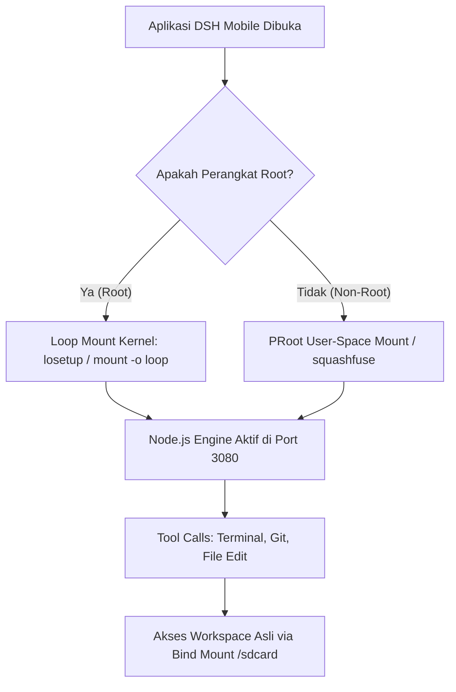

# 📋 Dokumen Analisis Arsitektur Runtime DSH Mobile (Android)
> **Topik:** Komparasi Sistem Penyimpanan Runtime DSH: *Loose Files Extraction* (Lama) vs *1-File Container Image* (Baru).  
> **Tujuan:** Analisis mendalam mengenai kelebihan, kekurangan, resiko performa (CPU/RAM/I-O), serta penanganan untuk perangkat **Root** vs **Non-Root**.

---

## 1. Latar Belakang Masalah
Aplikasi **DSH Mobile** menjalankan engine AI lokal berbasis **Node.js runtime** dan server DeepSeek Harness (DSH) secara *on-device* di Android. Paket runtime DSH dan dependensinya terdiri dari lebih dari **35.000 file Javascript/JSON/C++ addon kecil** di dalam folder `node_modules`.

Baru-baru ini ditemukan kendala: setelah beberapa jam aplikasi tidak dibuka, aplikasi tiba-tiba gagal booting dengan error:
```text
Error [ERR_MODULE_NOT_FOUND]: Cannot find package '@deepseek-ai/dsh-app-boot' imported from /data/user/0/com.dsh.mobile/files/dsh/lib/bin.js
```
Penyebabnya adalah **Android OS / OEM Cleaner (seperti MIUI Security / Deep Clean)** secara sepihak menghapus sebagian file di dalam direktori aplikasi saat HP *idle* untuk menghemat memori (*low storage / cache auto-eviction*).

---

## 2. Sistem Saat Ini (Loose Files Extraction)

### Cara Kerja:
1. Paket DSH dibungkus dalam bentuk archive `dsh-core.tar.gz` di dalam folder `assets/engine/` APK.
2. Saat aplikasi pertama kali dibuka (atau setelah update APK), Java `LocalEngineService` mengekstrak seluruh file ke penyimpanan privat:
   ```text
   /data/user/0/com.dsh.mobile/files/dsh/ (~35.000+ file & folder)
   ```
3. Node.js dijalankan secara langsung via `ProcessBuilder`:
   ```bash
   node /data/user/0/com.dsh.mobile/files/dsh/lib/bin.js --profile web --port 3080
   ```

### Kelebihan:
* **0% CPU Overhead**: Berjalan 100% native di Android Linux kernel langsung tanpa emulator/lapisan virtualisasi.
* **Fleksibel untuk Pengembang**: File Javascript di dalam `dsh/node_modules` dapat dibuka dan diedit langsung menggunakan file manager (seperti MT Manager).
* **Kompatibel Universal**: Berjalan sama baiknya di HP Root maupun Non-Root.

### Kekurangan:
* **Rentan Penghapusan Diam-diam**: Puluhan ribu file kecil mudah disasar oleh fitur *Cleaner* otomatis HP Android/MIUI. Jika satu modul saja terhapus, engine langsung lumpuh.
* **Beban Inodes Filesystem**: Menghabiskan puluhan ribu *inodes* di partisi `/data`.
* **Proses Ekstraksi Pertama Berat**: Membutuhkan waktu beberapa detik hingga puluhan detik saat instalasi/update untuk menulis 35.000+ file kecil ke flash memory internal.

---

## 3. Sistem Baru yang Diusulkan (1-File Container Image)

### Cara Kerja:
1. Seluruh direktori runtime DSH dipadatkan menjadi **1 file image tunggal** saat build APK di CI/CD, misalnya:
   - Format **SquashFS** (terkompresi, *read-only*): `dsh-system.squashfs` (~80–120 MB).
   - Atau format **Ext4 Image**: `dsh-system.img` (~200–300 MB).
2. Dari sudut pandang Android OS dan Cleaner HP, hanya ada **1 file data tunggal** di `/data/user/0/com.dsh.mobile/files/dsh-system.img`. Cleaner HP tidak bisa menghapus sebagian isi file di dalamnya.
3. Saat aplikasi dijalankan, sistem membaca isi image tersebut menggunakan arsitektur adaptif:



---

## 4. Analisis Perilaku: User ROOT vs NON-ROOT

### A. Untuk Pengguna ROOT
* **Mekanisme**: Menggunakan Linux Kernel Loop Device:
  ```bash
  su -c "losetup -f /data/.../dsh-system.img && mount -t ext4 /dev/block/loopX /data/.../mnt_dsh"
  ```
* **Performa**: **100% Native (0% CPU Overhead)**. Kecepatan baca-tulis identik dengan partisi sistem Android.
* **Tool Call**: Mendapatkan akses penuh ke binary Android host (Magisk/KernelSU/APatch `su`).

### B. Untuk Pengguna NON-ROOT
* **Mekanisme**: Menggunakan **PRoot** (yang binary-nya sudah terpasang di dalam aplikasi di `/data/.../bin/proot`).
  PRoot bekerja di level user-space menggunakan teknik *system call interception* (`ptrace`) tanpa membutuhkan izin root.
* **Performa**: Ada **overhead CPU (~10% - 15%)** saat melakukan operasi file I/O yang sangat cepat dan bertubi-tubi.
* **Tool Call**: Berjalan di dalam lingkungan Linux terisolasi yang stabil, dengan akses ke file penyimpanan pengguna via *bind mount* (`-b /storage/emulated/0:/workspace`).

---

## 5. Dampak Terhadap Tool Calls & Eksekusi Agen

| Kategori Tool Call | Dampak pada Sistem 1-File Image | Keterangan Teknis |
| :--- | :--- | :--- |
| **File Read / Write / Edit** | **Aman & Tidak Terpengaruh** | Folder proyek di `/storage/emulated/0` di-bind mount langsung, sehingga file proyek pengguna tetap dibaca dan ditulis di disk asli. |
| **Command Shell / Terminal** | **Jauh Lebih Lengkap & Stabil** | Di dalam container, agen mendapatkan utilitas Linux lengkap (GNU bash, curl, tar, python, dll.) alih-alih keterbatasan `toybox` bawaan Android. |
| **Perintah Root (`su`)** | **Tetap Berfungsi (Khusus Root)** | Binary `su` dari host di-forward (`-b /system/bin/su:/bin/su`), sehingga perintah root dari AI tetap dieksekusi oleh Root Manager HP. |

---

## 6. Tabel Komparasi Komprehensif

| Indikator | Sistem Lama (Loose Files) | Sistem Baru (1-File Container Image) |
| :--- | :--- | :--- |
| **Jumlah File Fisik di HP** | ~35.000 file kecil | **Tepat 1 file data tunggal** |
| **Ketahanan dari Pembersih HP** | ❌ **Rentan** (Bisa hilang sewaktu-waktu) | ✅ **100% Kebal** (File tidak bisa dicacah) |
| **Waktu Persiapan Pertama Buka** | ⏳ Lambat (ekstrak 35.000 file) | ⚡ **Instan** (Hanya copy/baca 1 file) |
| **Overhead CPU (Non-Root)** | ✅ **0%** (Native Process) | ⚠️ **~10-15%** (karena PRoot ptrace) |
| **Overhead CPU (Root)** | ✅ **0%** (Native Process) | ✅ **0%** (Kernel Loop Mount) |
| **Penggunaan Storage / Ukuran** | Memakan ~350 MB + puluhan ribu inodes | Jika SquashFS: hanya ~120 MB (terkompresi) |
| **Kemudahan Modifikasi Core DSH** | ✅ Sangat mudah via MT Manager | ⚠️ Read-Only (Harus rebuild image) |
| **Keamanan Data Pengguna (Chat/Keys)**| Aman di `.dsh/` | Tetap di luar image di `.dsh/` (100% aman) |

---

## 7. Opsi Alternatif: "Self-Healing Loose Files"

Jika kekhawatiran terbesar adalah **overhead CPU 10% pada HP Non-Root**, ada jalan tengah:
* Tetap mempertahankan sistem **Loose Files** (0% overhead).
* Di dalam Java `LocalEngineService.java`, tambahkan **Sensor Integritas Otomatis**:
  Aplikasi tidak hanya mengecek keberadaan `bin.js`, tetapi juga mengecek folder penting seperti `node_modules/@deepseek-ai/dsh-app-boot`.
* Jika terdeteksi ada modul yang terhapus oleh cleaner HP, aplikasi secara otomatis mengekstrak ulang bagian yang hilang dalam waktu **< 1 detik** saat aplikasi dibuka, mencegah terjadinya crash tanpa membebani performa.
